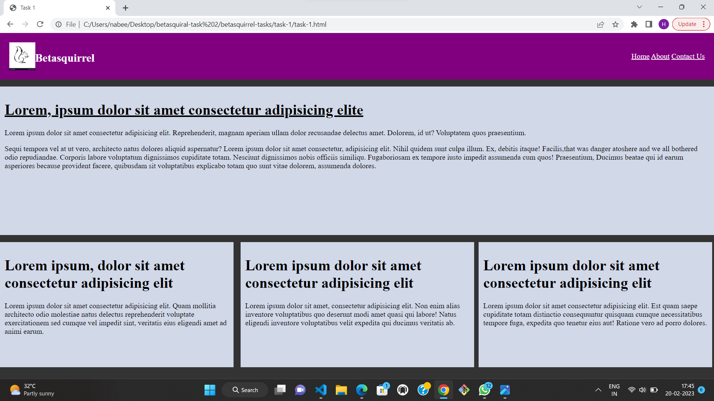
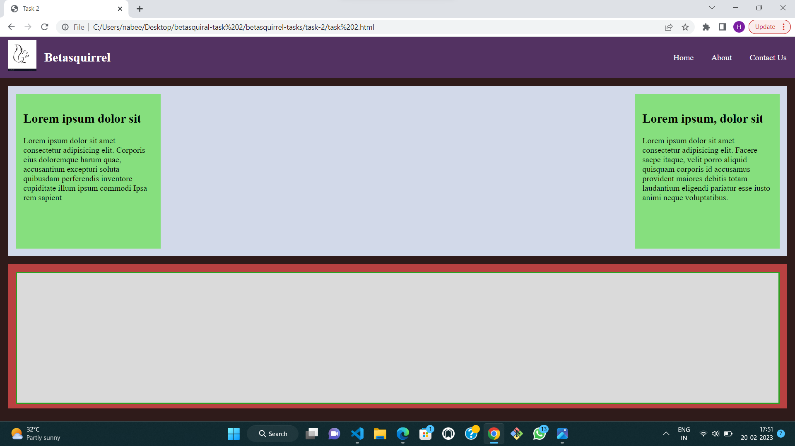

# betasquirrel-tasks

Assignments from betasquirrel

README.md

## Requirments

| Requirments                              | Output                                         |
| ---------------------------------------- | ---------------------------------------------- |
|  |  |
|  |  |
|  |  |

## Importent Notes

## task-3

Read the below pages and attend the tests.

- [HTML](https://www.w3schools.com/html/html_intro.asp)
- [elements](https://www.w3schools.com/html/html_elements.asp)
- [atributes](https://www.w3schools.com/html/html_attributes.asp)
- [headings](https://www.w3schools.com/html/html_headings.asp)
- [paragraps](https://www.w3schools.com/html/html_paragraphs.asp)
- [styles](https://www.w3schools.com/html/html_styles.asp)
- [formatting](https://www.w3schools.com/html/html_formatting.asp)
- [quotations](https://www.w3schools.com/html/html_quotation_elements.asp)
- [comments](https://www.w3schools.com/html/html_comments.asp)
- [colors](https://www.w3schools.com/html/html_colors.asp)
- [css](https://www.w3schools.com/html/html_css.asp)
- [links](https://www.w3schools.com/html/html_links.asp)
- [images](https://www.w3schools.com/html/html_images.asp)
- [classes](https://www.w3schools.com/html/html_classes.asp)
- [id](https://www.w3schools.com/html/html_id.asp)
- [favicon](https://www.w3schools.com/html/html_favicon.asp)
- [tables](https://www.w3schools.com/html/html_tables.asp)
- [lists](https://www.w3schools.com/html/html_lists.asp)
- [block & inline](https://www.w3schools.com/html/html_blocks.asp)
- [frames](https://www.w3schools.com/html/html_iframe.asp)
- [javascript](https://www.w3schools.com/html/html_scripts.asp)
- [file paths](https://www.w3schools.com/html/html_filepaths.asp)
- [head](https://www.w3schools.com/html/html_head.asp)
- [layout](https://www.w3schools.com/html/html_layout.asp)
- [responsive](https://www.w3schools.com/html/html_responsive.asp)

#### HTML TABLES

- [tables](https://www.w3schools.com/html/html_tables.asp)
- [table borders](https://www.w3schools.com/html/html_table_borders.asp)
- [table sizes](https://www.w3schools.com/html/html_table_sizes.asp)
- [table headers](https://www.w3schools.com/html/html_table_headers.asp)
- [paddind & spacing](https://www.w3schools.com/html/html_table_padding_spacing.asp)
- [colspan & rowspan](https://www.w3schools.com/html/html_table_colspan_rowspan.asp)
- [table styling](https://www.w3schools.com/html/html_table_styling.asp)
- [table colgroup](https://www.w3schools.com/html/html_table_colgroup.asp)

#### HTML FORMS

- [HTML forms](https://www.w3schools.com/html/html_forms.asp)
- [form attributes](https://www.w3schools.com/html/html_forms_attributes.asp)
- [form elements](https://www.w3schools.com/html/html_form_elements.asp)
- [input types](https://www.w3schools.com/html/html_form_input_types.asp)
- [input atributes](https://www.w3schools.com/html/html_form_attributes.asp)
- [input form atributes](https://www.w3schools.com/html/html_form_attributes_form.asp)

## Linux Commands

- `cd` - Change current directory. Ex: `cd Desktop`, `cd ..`
- `ls` - List contents of a directory. Ex: `ls -a` lists hidden files as well.
- `pwd` - Display current working directory path
- `cat` - Display contens of a file. Ex: `cat README.md`

## Git Commands

1. `git config` Config git user. Ex: `git config --global user.name "hudanabeel" `, `git config user.email "huda45852@gmail.com"`
2. `git clone` Clone a remote git repo to your local. Ex: `git clone https://github.com/HudaNabeel/betasquirrel-tasks.git`, `git clone https://github.com/HudaNabeel/betasquirrel-tasks.git new-folder`
3. `git add` Add your file changes to git. Ex: `git add .`, `git add README.md`
4. `git commit` Commit chnges to git. Ex: `git commit -m "Initial commit"
5. `git push` Push your local commits to remote repo. Ex:`git push origin main`
6. `git stash` This command can be used when we want to save our work without staging or committing the code to our Git repository and want to switch between branches.
7. `git pull` The git pull command first runs `git fetch` which downloads the contens from the specified remote repository and then immeadiately updates the local repo to match the content.
8. `git diff` Diffing is a function that takes two input datasets and outputs the changes between them.The git diff command is a multi-use Git command which,when executed,run adiff function on Git data sources.These data sources can be commits,branches,files,and more.The git diff command is often used along with the git status and git log commands to analyze the current state of our Git repository.We use `git log` to get the details of commit IDs.
